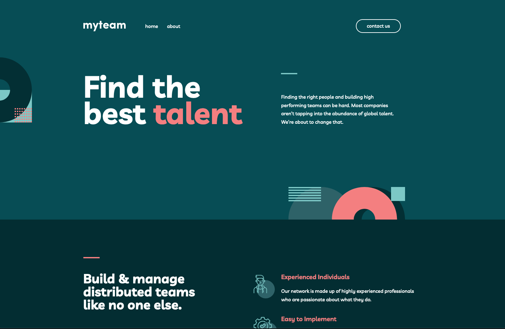

# Frontend Mentor - myteam website solution

This is a solution to the [myteam website challenge on Frontend Mentor](https://www.frontendmentor.io/challenges/myteam-multipage-website-mxlEauvW)

## Table of contents

-  [Overview](#overview)
   -  [The challenge](#the-challenge)
   -  [Screenshot](#screenshot)
   -  [Links](#links)
-  [My process](#my-process)
   -  [Built with](#built-with)
   -  [What I learned](#what-i-learned)
   -  [Continued development](#continued-development)
   -  [Useful resources](#useful-resources)
-  [Author](#author)

## Overview

### The challenge

Your users should be able to:

-  View the optimal layout for each page depending on their device's screen size
-  See hover states for all interactive elements throughout the site
-  See the correct content for each team member on the About page when the + icon is clicked
-  Receive an error message when the contact form is submitted if:
-  The Name, Email Address or Message fields are empty should show "This field is required"
-  The Email Address is not formatted correctly should show "Please use a valid email address"

### Screenshot



### Links

-  Live Site URL:

## My process

### Built with

-  Semantic HTML5 markup
-  Mobile-first workflow
-  Flexbox
-  CSS Grid
-  Sass
-  Typescript

### What I learned

```html
<a class="skip-to-content text-pm-white btn btn--pm" href="#main-content"
   >Skip to main content</a
>

<legend class="sr-only">Contact form</legend>
```

One big step I took towards increasing the accessibility of my future projects was learning about how to implement a 'skip to content' link, which would be visually hidden but still accessible by visually impaired users. This link would direct users to the `<main>` sections of content, which provides a great benefit to users who don't want to tab through pre-existing content each time they visit the page.

I also included a `<legend>` within the form on the Contact page, even though within the design there didn't seem to be one visible. I added the 'sr-only' class to visually hide the `<legend>`, but it would still be read aloud with each form element the user would focus on.

```scss
$type-scale: (
   small: (
      fs-500-contact: 2.9rem,
      fs-500: 3.8rem,
      fs-500-about: 3.8rem,
      ...,
   ),
);

:root {
   @each $color, $value in $colors {
      --clr-#{$color}: #{$value};
   }
}

@each $color, $value in $colors {
   .text-#{$color} {
      color: var(--clr-#{$color}, $value);
   }
}
```

Since this was my first time building a multi-page site, I decided to implement the use of utility classes to handle all the basic styling required cross-site. Sass provides many features that allow us to not only produce these utility classes, but also declare CSS variables based on a set of data housed in either a map or a list. Furthermore, these variables can be re-declared at different media breakpoints so that their value automatically changes, preventing the need for us to manually do so.

```scss
.sidebar {
   display: none;
   @include mq(max-width, tablet) {
      display: block;
      padding: min(10rem, 20vh) 3rem;
   }
}
```

As explained in the [Useful resources](#useful-resources) section, one of the major features I learnt from Kevin through watching his course on Scrimba, was his use of logical properties (`min()`) to achieve fluid spacing between different screen sizes. This means we don't necessarily have to declare a media query to change that spacing amount manually, but the logical property will dynamically handle this behaviour for us. It also nicely accomodates a landscape orientation for tablet devices which, as demonstrated with the code snippet above, will fluidly respond to maintain a minimum amount of vertical spacing when the viewports height is decreased.

```scss
.header {
   @include m(home) {
      @include mq(min-width, large) {
         background-image: url('../assets/bg/bg-pattern-home-1.svg');
         background-repeat: no-repeat;
         background-position: calc(0% - 100px) 90%;
         background-size: 200px;
      }
      @include mq(min-width, align-mw) {
         background-position: calc(0% - 100px) 37%;
      }
   }
}
```

Since this was my first project where an official tablet design was provided for me to work with, it truly opened my eyes to the design possibilites and techniques we may use to accomodate such devices. Up until this point, I was relying on increasing font-sizes to fill the empty space before the layout would respond to a wider viewport. Naturally, I was aware that this was only a temporary solution, if a solution at all, but within this project I was able to experiment with altering the position of background shapes at different viewports to fill the empty space in a more appropriate manner.

```ts
function validate(e: Event) {
   const userData: HTMLInputElement[] = Array.from(
      form.querySelectorAll('[data-required="true"]')
   )
   const errors = userData.filter(
      (input) => input.value === '' || input.value === null
   )
   if (
      !regex.test(email.value) &&
      !errors.find((input) => input.id === 'input-email')
   )
      errors.push(email)
   if (errors.length) {
      e.preventDefault()
      errors.forEach((input) => createErrorMsg(input))
   }
}
```

I was really proud of the dynamic logic that I implemented for validating all the form inputs within this project. Having spent most of my time recently working within the React library, I found myself thinking in a more advanced manner when returning to vanilla JavaScript, especially in regards to using data structures and the methods they come with to perform logic in a more concise syntax.

### Continued development

Although I was happy with my final solution to the challenge, I did make a lot of mistakes along the way regarding my efficiency and the order in which I decided to begin tackling certain tasks. For example, I built out the HTML for all three pages first before even touching any of the CSS, which was a big mistake since all further changes I made to one page would then have to be copied over to the others if shared between them.

I would like to learn more about advanced animation for use on the hamburger icon when clicked, as well as the dynamic open/close icons on the about page to add an extra level of sophistication to the site.

Finally, I feel it would be beneficial to better organise my Sass maps for future projects by splitting them up into smaller maps, instead of nesting multiple loops within one another and using conditional logic to output different results.

### Useful resources

-  [Build a space travel website with Kevin Powell](https://scrimba.com/learn/spacetravel) - As this way my first multi-page project to this degree of scale, I wanted to adopt a methodology that allowed me to work efficiently when tackling such a project. Kevin is an amazing teacher who I learn from every time I watch, and these series of lessons helped me refine the way I organised my CSS, most notably through the use of utility classes.

-  [Modular CSS with Sass Course](https://teamtreehouse.com/library/modular-css-with-sass) - Treehouse is an immense resource of great information from long-time developers in the industry. Although some of it can be outdated, the theoretical knowledge you gain of how each technology works behind the scenes way outweighs that small issue.

-  [Kevin Powell - most common HTML mistakes](https://www.youtube.com/watch?v=NexL5_Vdoq8&ab_channel=KevinPowell) - This video was a great resource in showing me how to semantically structure a HTML page, focusing on not overusing headings and instead styling additional context about sections of content in the style of another element, if that design is desired.

-  [Generate Custom Properties & Utility Classes with Sass](https://www.youtube.com/watch?v=gP8yFWCTr7Q&ab_channel=KevinPowell) - Since I was working in Sass, I used this tutorial to learn more about specific features like `@each` loops, that we can use to generate variables and utility classes based off data inputted into either Sass maps or lists.

## Author

-  Website - [Joshua Jameson-Wallis](https://joshuajamesonwallis.com)
-  Linkedin - [Joshua Jameson-Wallis](https://www.linkedin.com/in/joshua-jameson-wallis/)
